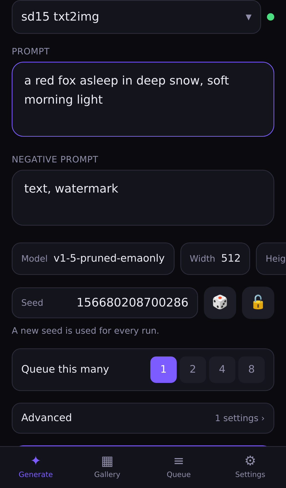
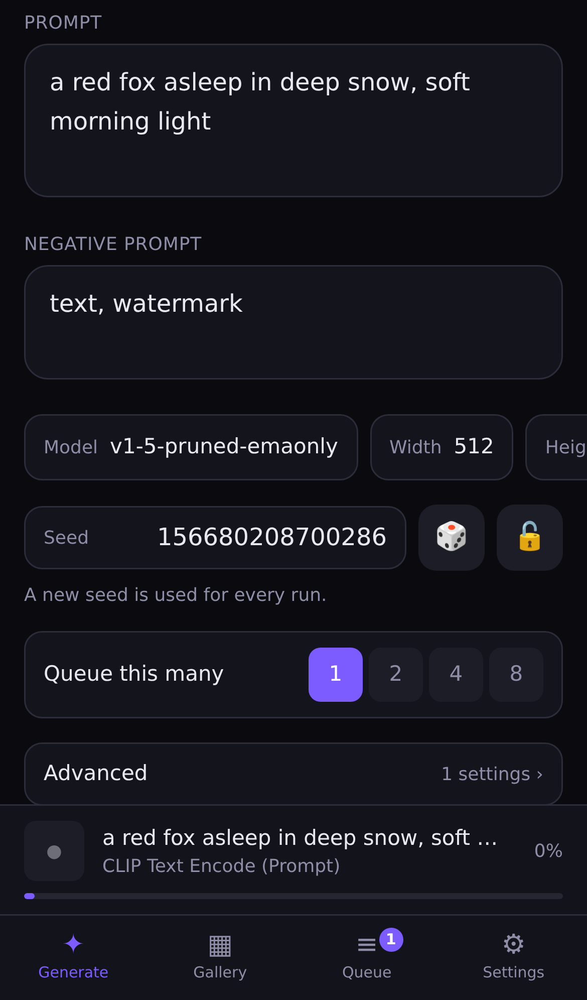
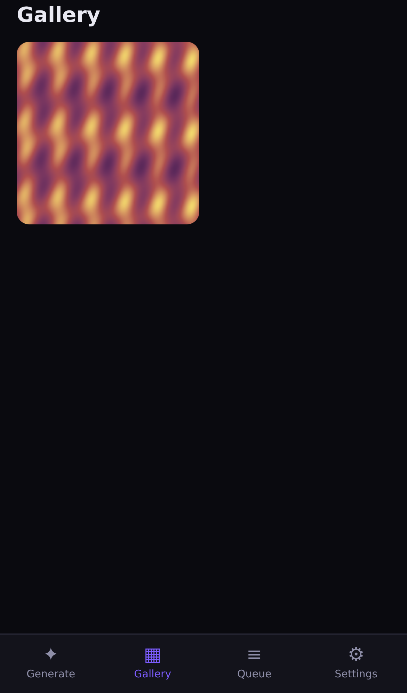

# Latent

A mobile-optimised frontend for an existing ComfyUI instance.

ComfyUI's own interface is a desktop node graph — you cannot comfortably pan it,
tap its widgets, or watch a render while your phone is in your pocket. But
*using* a workflow you already built is simple: type a prompt, nudge a few
numbers, tap generate, look at the picture.

Latent is that. You import a workflow once, and it becomes a clean, thumb-sized
form. Nothing about your ComfyUI setup changes.

<p align="center">
  
  
  
</p>

## What it does

- **Any workflow you already have.** Point Latent at your ComfyUI folder and it
  reads the workflows saved in it — the ones you marked, by default those whose
  file name starts with `API_`, since an installation that has been used holds
  every experiment anybody ever saved — the editor's own files, not just an
  *Export (API)*. For each one it works out which inputs are editable and builds
  a form: prompt, seed, steps, CFG, sampler, dimensions, model pickers. Model and
  sampler lists come from your server, so they are always the files you actually
  have installed.
- **Remote instances, including vast.ai.** Save any number of connections and
  switch between them. Bearer or basic tokens, and self-signed certificates, are
  all handled — see [Connecting to vast.ai](#connecting-to-vastai).
- **Live progress, with numbers.** A persistent bar shows the live preview, the
  sampler's step rate and **how much longer it has to go**, follows you between
  tabs, and **stays on screen when the run finishes** so you actually see the
  picture you waited for. A tap opens the full timing breakdown without covering
  the app.
- **A queue you can actually manage.** Every waiting job lists the settings it
  was submitted with — including its seed — so you can tell eight variations of
  one prompt apart and cancel the one you regret. One switch expands them all
  for a side-by-side comparison.
- **Gallery.** Every result, with the exact settings that produced it. Swipe
  through the whole gallery, pinch to zoom, tap to close, save to your camera
  roll, re-run, or send a result straight to img2img or an upscale pass.
- **Divided into days, sorted how you like.** The grid is cut at midnight and
  each day folds away when you tap its divider, so a few days back is a tap
  rather than a minute of scrolling. Order by newest, oldest, or the best
  picture in each run.
- **Values on the pictures.** Pick which settings to draw over the thumbnails —
  `St20 Cf8`, small enough to fit — so a sweep can be compared at a glance
  without opening anything. The full-size viewer has its own separate choice.
- **Ratings that outlive the GPU.** Rating an image copies it onto the machine
  running Latent — **encrypted**, so it survives the rented instance being
  destroyed without leaving your pictures readable on disk.
- **Keep, delete, and a cleanup that runs itself.** Keeping stores a picture
  without passing judgement on it; anything nobody rated, kept or favourited is
  deleted after a period you choose, so the gallery stays worth scrolling.
- **Favourites.** Keep an image together with the settings that made it, rate
  those separately, and generate more like it in one tap.
- **A grid that fits the pictures.** Adjustable column count; each tile takes its
  shape from the image's aspect ratio so nothing is cropped square, with a
  per-image override. Only thumbnails are ever downloaded.
- **Import an existing output folder.** Point Latent at a ComfyUI output
  directory and walk it a folder at a time — a day, a project, a model — with
  image counts on each. Import a picture, a selection, or a whole folder tree in
  one tap, and **imported pictures keep the settings ComfyUI wrote into them**,
  so "reuse these settings" works on work made long before Latent existed.
- **LoRA editor.** `<lora:name:0.8>` tags become compact rows with a strength
  slider and a picker, instead of something you type by hand on a phone keyboard.
- **Parameter presets.** Save a whole set of settings per workflow and re-apply
  it in one tap.
- **Saveable form layouts.** Arrange a workflow's form once — what shows, what
  it's called, what goes under Advanced — save it under a name, and switch
  between arrangements later.
- **Prompt blocks.** Save the phrases you reuse and assemble a prompt by tapping
  chips instead of typing paragraphs on a phone keyboard. Tapping a chip again
  takes that phrase back out. They have a **Blocks** tab of their own for making,
  grouping and ordering them — laid out two to a row, because a library worth
  having is longer than one screen.
- **A form you build.** Drag fields into the order you want, give each one half a
  row or a whole one, rename or hide anything — per workflow, saved under a name.
- **Parameter studies.** Sweep a workflow's settings across hundreds of
  pictures, rate them blind by tapping the top, middle or bottom of each one,
  and get a statistical read-out of which settings actually mattered. The
  pictures stay in the module rather than filling the gallery.
- **A monitor.** VRAM, GPU, CPU and sampler speed over time, with the queue's own
  events marked on the same axis, so "why did that take so long" has an answer.
- **Text outputs.** Whatever the graph printed rather than drew — an expanded
  wildcard, a generated caption — kept with the run and shown with the picture.
- **Privacy blur.** Every image in the app, heavily out of focus, in one tap.
- **Random prompt mode.** Let the app draw the prompt from your blocks instead —
  from the whole library or a pool you narrow by hand. Every queued run gets its
  own draw, so a batch of eight is eight different pictures. It has its own
  **Random** tab, because it is a screenful you arrange once and come back to.
- **A model to talk to.** Point Latent at a local `llama-server` and the **Chat**
  tab becomes the place you work out what to make: describe a picture in prose,
  argue about it, show it a photo you like, answer the odd question it stops to
  ask, and *then* ask for a prompt. Every tool it wants to use is a dialog you
  approve or refuse, and how readily it reaches for each one is yours to set.
  **Generate** on that dialog queues the prompt without leaving the
  conversation, and the picture arrives in it.
- **Parameter sweeps.** Give any numeric setting a range and an interval; each
  run draws one of the resulting values. Saved together with the prompt setup as
  one named thing, because that is how it is used.
- **Point lines.** Any numeric field can be a row of pre-set values instead of a
  sheet with a slider and a keyboard — set the range and interval once, then
  changing Steps from 20 to 40 is a single tap.
- **Edit a photo before it uploads.** Crop to an aspect ratio, rotate by quarter
  turns or a free angle, mirror and downscale on the device, so an img2img input
  is the right shape before the bytes are sent anywhere.
- **An input folder.** ComfyUI's own `input` directory — reference shots,
  sketches and masks — picked straight from the image input and copied
  server-side, so the file never travels to your phone and back.
- **Queue.** See what is waiting, remove single jobs, clear the lot.
- **Installable.** Add it to your home screen and it runs full-screen like an app.
- **Password protected.** The first person to open a new install chooses the
  password.
- **Settings that outlive the project folder.** Everything you arrange is
  mirrored to two files one directory above the checkout, and the database and
  image archive live there too — so a clean reinstall keeps your gallery, your
  layouts, your presets and your prompt library.
- **System prompts, collected.** The instructions a workflow buries inside a node
  live in one named list instead, and fill any text input of the same name.
- **Optional terminal** for maintaining the host, off unless you enable it.

## Requirements

- Node.js 20.11 or newer
- A running ComfyUI instance the Latent server can reach
- Optional: a `llama-server` (llama.cpp) the Latent server can reach, for the
  [Chat](#chatting-with-a-model) tab

## Quick start

```bash
git clone https://github.com/alexrutz/Latent.git
cd Latent
npm install
npm run build

COMFY_URL=http://127.0.0.1:8188 npm start
```

Then open `http://<your-computer's-LAN-ip>:6173` on your phone, **choose a
password when it asks**, and add it to your home screen.

### Configuration

All optional, set as environment variables:

| Variable | Default | Purpose |
| --- | --- | --- |
| `COMFY_URL` | `http://127.0.0.1:8188` | Seeds the first connection on a fresh install |
| `PORT` | `6173` | Port Latent serves on |
| `HOST` | `0.0.0.0` | Bind address (`0.0.0.0` so your phone can reach it) |
| `LATENT_PASSWORD` | *unset* | Fixes the password, skipping the first-run prompt |
| `LATENT_DATA_DIR` | `../latent-data` | SQLite database and the image archive |
| `LATENT_STATE_DIR` | `..` | Where the portable settings files are written |
| `LATENT_TERMINAL` | *unset* | Set to `1` to enable the built-in shell |
| `LOG_LEVEL` | `info` | `trace`…`silent` |

After the first run, connections are managed in the app — `COMFY_URL` only
matters for the very first boot.

### The password

Latent always requires one. On a fresh install the first person to open it
chooses the password, and that window closes permanently once they do.

**That means whoever reaches the address first gets the server.** Do it
immediately, or set `LATENT_PASSWORD` and skip the window entirely — which is
the right choice for anything unattended or reachable from outside your network.

## Connecting to vast.ai

vast.ai puts ComfyUI behind a proxy that requires a token, and — if the instance
was started with `ENABLE_HTTPS=true` — a self-signed certificate.

**When renting the instance, set `WEB_PASSWORD` to something you choose.** That
value replaces the auto-generated `OPEN_BUTTON_TOKEN`, which you otherwise
cannot read without SSHing into the box.

Then in Latent, **Settings → Connections → Add**:

| Field | Value |
| --- | --- |
| Address | The host and port the instance portal shows for ComfyUI |
| Authentication | **Token** (sent as `Authorization: Bearer …`) |
| Token | Your `WEB_PASSWORD` |
| Allow self-signed certificate | On, if the address is `https://` |

Hit **Test** first — it distinguishes "wrong address" from "wrong token" from
"self-signed certificate", rather than just failing. Then **Save**, and
**Use this** to switch to it.

Basic auth works too (`vastai` / your token) if you prefer it.

> Allowing a self-signed certificate means Latent stops verifying *who* it is
> talking to on that connection. It is per-connection and off by default. It is
> also the only way to reach a vast.ai instance using its own certificate.

### Docker

```bash
docker compose up -d
```

`docker-compose.yml` assumes ComfyUI runs on the host; adjust `COMFY_URL` if not.

## One folder, and the workflows in it

Latent asks for **one path**: where ComfyUI is installed. A stock install keeps
everything in known places under it, so the rest follows —

```
<ComfyUI>/output                    pictures to import
<ComfyUI>/input                     pictures to feed into workflows
<ComfyUI>/user/default/workflows    every workflow you have ever saved
```

Enter it under **Settings → ComfyUI folder** and tap **Read workflows**. That
converts the editor's own save format on the way in: the positional widget lists
those files use are walked against `/object_info`, so `20` is understood to be
`steps` without anybody re-exporting anything.

**Only the marked ones are read.** An installation that has been used for a
while holds every experiment anybody ever saved, and importing all of them makes
a list nobody can find anything in. So a file has to start with a prefix —
`API_` unless you change it, next to the folder setting — and the prefix is
dropped from the name afterwards, since it marks the file on disk and repeating
it on every row would waste the width. Clear the setting to read everything.

Marking a workflow costs one rename in the editor and is something you do once.
The alternative is scrolling past thirty experiments every time.

They still arrive **switched off**, because "worth having on the phone" and
"worth being in the picker right now" are different questions — each has a
switch in Settings, and only the ones you turn on appear when you generate.

The list groups itself. Workflows are named after the file they came from, so a
real subfolder shows up as `portraits/closeup` and a naming scheme as
`SDXL_fast`; both are treated as folders you can fold shut. A folder of one is
not a folder — those stay in the flat list.

An *Export (API)* file still imports one at a time through **Settings → Import**,
and so does an editor file if you would rather pick it by hand.

If a workflow uses a node this ComfyUI does not have, or has nothing in it that
saves an image, the import says exactly that instead of failing later at submit
time.

### If the form isn't quite right

Latent identifies fields by node class and input name. That covers the usual
workflows, but no heuristic handles every custom node — anything it doesn't
recognise goes to **Advanced** rather than being dropped. Use
**Settings → Edit form** to show, hide, rename or promote any field. Those
edits are stored separately from the derived form, so **Refresh models** (which
re-reads node definitions after you install something new) never overwrites them.

Rearranging a form on a phone is fiddly enough that you should only do it once.
**Save current** at the top of that sheet stores the arrangement under a name,
and tapping a saved layout puts it back — so one workflow can have a stripped
"just the prompt" layout and a full one, and you switch rather than re-edit.
Deleting a layout only forgets the arrangement; it never changes the form you
are looking at.

### Building the form

**Settings → Edit form** is a layout tool, not a list of switches:

- **Drag the handle** on any field to reorder it. The order here is the order on
  the Generate screen.
- **Half a row or a whole one.** The form is two columns of chips; a field set to
  full takes the width of both. A sampler name needs the room its longest option
  does, while four short numbers read better side by side — which is why it is a
  per-field choice rather than a rule.
- **Rename, hide, or move to Advanced.** A rename saves as you type: it used to
  save on blur, which on a phone meant closing the sheet threw it away.

### Sliders, or a line of points

Every numeric field has two ways of being edited, chosen per field under
**Settings → Edit form**:

- **Slider** — the chip opens a sheet with a slider and a keyboard. Right for a
  value that could be anything.
- **Points** — a row of pre-set values on the form itself. Set the range and the
  interval (`20 to 50, step 10` gives `20 30 40 50`, listed under the fields so
  there is nothing to work out), and from then on changing the value is one tap.

The second exists because of how these values are actually used: nobody sweeps
Steps continuously, they cycle between the same handful of numbers, and three
taps plus a keyboard to get from 20 to 30 is three taps too many. A value that
arrives from a preset, a reused result or a random draw and lands between two
points highlights the nearest one and says **off the line**, rather than quietly
rounding itself.

Everything that stays a chip is laid out in **two even columns**, so a sampler
block reads as a list you can scan down instead of a wrapped heap of
differently-sized bubbles.

## Where your data lives

**Everything is outside the project directory**, which is the one you delete
when you want a clean reinstall:

```
../latent-data/            the database, and the encrypted image archive
../latent-settings.json    every arrangement: app settings, connections,
                           per-workflow form layouts and presets, the
                           variation setups
../latent-prompt-blocks.json   the prompt library, on its own
```

An install made when the database lived in `./data` moves itself the first time
it starts, so there is nothing to do about it.

The database stays the source of truth at runtime; the two JSON files are
mirrored from it whenever it changes, and read back on boot into whatever the
database does not already have. The point is the clean start: delete the project
folder, clone it again, import the same workflow — and the form you built, the
layouts you named and the phrases you saved are all still there. Workflows are
matched by **name**, because the id is generated at import time and a re-imported
workflow is a different row.

Two files rather than one because they are used differently: the prompt library
is worth copying to another machine or keeping in version control on its own,
while the rest is this installation's configuration.

Restoring is additive and never overwrites: anything already in the database
wins, so a stale file cannot undo work. Set `LATENT_STATE_DIR` to put them
somewhere else.

**Both files are encrypted**, with AES-256-GCM under a key derived from your app
password — they hold connection secrets and your whole prompt library, and they
sit in a directory chosen precisely because it does not get deleted. They are
readable only after somebody signs in, which has one consequence worth stating
plainly: wiping the database and then choosing a *different* password on the way
back up leaves them undecryptable. Latent refuses to overwrite a file it could
not read, and says so in the log, rather than quietly destroying what it holds.
Changing the password rewrites both files under the new key.

**Unlocking after a restart.** The archive key is derived from the password and
only ever held in memory, so restarting the Latent server takes it. The *session*
survives — the cookie is signed against the stored password hash, so it keeps
verifying — which leaves the app signed in, generating perfectly well, and unable
to import or keep an image. When that happens a bar appears across the top and
Settings → Session offers **Unlock the archive**; both ask for the same password
you sign in with, and anything that fails because the archive is shut opens the
same dialog on the spot. Signing out is not needed and never was the point.
Setting `LATENT_PASSWORD` skips all of this: the archive is unsealed at boot.

## What the graph printed

Not every output is a picture. A **"preview as text"** node — `PreviewAny`,
`ShowText` and the rest — is how a workflow tells you what it decided: the prompt
after a wildcard expanded, a caption a vision model wrote, a size a node
computed. Latent records those with the run and shows them under the picture in
the viewer, and on the Monitor's timeline as they arrive.

Any output field that is not one of the known binary payloads counts, whatever
the node called it, because there is no convention here and a list of node types
would be out of date within a month.

## The monitor

A tab with two halves that only make sense together: what the machine was doing,
and what it was doing it for. VRAM, system RAM, sampler speed and queue depth
over time, with the queue's own events — queued, started, each node, finished,
failed, connection lost — marked on the same axis and listed underneath.

**Choose what is on screen.** Six charts on a phone are six unreadable charts,
so the chips above them switch each reading on and off — VRAM for a model that
will not fit, sampler speed for one that has gone slow. The choice is kept on
the device, because it is about this screen rather than about the installation.

**With one or two charts, the events stand on the line.** Each one is named at
its own tick, turned a quarter clockwise so a label takes a few pixels of width
rather than a few dozen — which is what lets several inside one render sit next
to each other instead of overprinting. With more charts than that there is no
room for it and the ticks are enough to line the curves up against each other.
The window is adjustable down to a minute for the same reason: half a dozen
events inside one render are one smudge at half an hour to the screen.

**GPU and CPU load are not part of ComfyUI.** Core ComfyUI reports VRAM and RAM
through `/system_stats` and nothing else, so those two charts say "not reported"
rather than drawing a flat line at zero. Install the widely used **Crystools**
extension on the ComfyUI box and Latent picks up its broadcasts over the socket
it already holds — no extra configuration, and no polling of a second endpoint.

Readings are taken every two seconds while something is running and every twenty
when the box is idle, and kept **in memory**: this is the recent past, the window
in which you are still asking why something just happened, and writing a row
every two seconds to answer that is a poor trade against an SD card. Switching
connection clears it, because a different endpoint is a different machine.

## Coming back to the app

The socket is the source of truth **while it is connected**. It is not a record
of what it missed, and that distinction was a real fault: a phone that locks its
screen drops the connection, the runs in flight finish without anybody hearing
about it, and on reconnect the server sends a snapshot of the *live* state — the
job, the queue — with no events for work that ended in the meantime. The gallery
kept its placeholders and went on saying "rendering" about pictures already on
disk, until some other screen happened to refetch it.

Reconnecting and becoming visible are exactly the two moments the client may
have missed something, so both now refetch the history.

## Keeping images when the instance goes away

A gallery entry normally just points at a file in ComfyUI's output directory. If
that ComfyUI is a rented GPU, the directory stops existing the moment you end the
rental — and every image you liked goes with it.

**Rating an image copies it onto the machine running Latent.** From then on the
gallery serves it from there, so it keeps working with the instance destroyed.
The gallery's **Rated** and **★ 4+** filters show what you have kept, and
Settings reports how much disk the archive is using and can drop copies of
anything unrated.

This is why it matters where Latent runs: put it on a machine that stays up (a
PC, a NAS, a small always-on box), and point it at whatever GPU you are renting
today.

Files are content-addressed, so the same picture is stored once however many
times it is rated or imported. One consequence is worth stating: after a clean
start the archive survives but its master key does not, so files already there
were encrypted under a key the new install has never seen. Latent checks that it
can actually *read* a file before treating it as already stored, and rewrites it
if not — otherwise re-importing a picture would record a row pointing at bytes
nobody can ever decrypt.

### The archive is encrypted

Those copies then sit on a disk indefinitely, so they are encrypted:

- A random 256-bit master key encrypts every file with AES-256-GCM.
- That master key is itself wrapped with a key derived from your password
  (scrypt). The password is never stored.
- The master key only ever exists **in memory**, and only after somebody signs
  in. Restart the server and the archive is sealed again until the next login.

So a stolen disk, a backup, or someone sitting at the machine gets nothing but
ciphertext. Changing your password re-wraps the master key, which takes
milliseconds — no image is ever re-encrypted.

**Metadata stays readable.** Prompts, seeds and settings remain in the database
in the clear, which is what lets the server sort and filter by rating without
decrypting everything first — and what means the settings behind an image are
still there years later.

> **If you forget the password, the images are gone.** There is no recovery key
> and no back door; that is what makes the encryption worth anything. The
> database, and the settings in it, survive — the pictures do not.

## An input folder

`<ComfyUI>/input`, found from the folder you already entered. Its contents
appear behind **From folder** next to any image input — reference shots,
sketches, masks, anything a workflow should read rather than produce.

Tapping a picture copies it into ComfyUI's input directory **server-side**. The
bytes go from the Latent machine straight to ComfyUI; nothing travels to the
phone, which is what makes picking a 12 MP photo cost one small request instead
of a download and a re-upload. The grid itself only ever loads generated
thumbnails.

**Folders are the categories.** The picker walks the tree one level at a time,
with a count on each folder and a breadcrumb back out — a reference library is
sketches and masks and photographs of one subject, and the folders they are
already in on disk are the categorisation. Typing in the filter searches the
whole tree instead, because "where is the one called sketch-3" is a different
question from "what is in here".

**Edit** on a picture is the opt-in path: only then is the original pulled down,
so you can crop or straighten it first. The result is uploaded like any other
edited photo.

The folder is strictly read-only — Latent never writes to it — and, like the
import folder, a path is refused the moment it tries to escape the configured
root.

**The image input folds away.** Its preview is the whole picture at thumbnail
size, sitting on the screen you look at with other people around, so the label
is a fold: tap it and only the filename is left. The choice is remembered per
input, and survives a reload.

## Importing an existing output folder

**A folder at a time.** `<ComfyUI>/output` is routinely tens of thousands of
files in dozens of dated folders, and a flat list of all of them is something
nobody can find anything in. Settings → *Import from a folder* walks the tree
one level at a time, with the image count on each folder, and imports
a single picture, a selection, or a whole folder and everything under it in one
request — the expansion happens on the server, so a phone never sends ten
thousand paths.

**Imported pictures remember how they were made.** ComfyUI writes the graph it
ran into every PNG it saves. Latent reads it back, matches it against the
workflows you have imported here — by node id *and* class, so a graph that
merely numbers its nodes the same way is not mistaken for yours — and stores the
settings with the picture. "Reuse settings" then works on work made long before
Latent existed. Pictures with no metadata, or from a workflow you do not have,
come in as before.


**Settings → Import from a folder.** Give it a path, and Latent walks it
recursively, lists every image, and marks the ones already in your library.
Select what you want and import — the files are copied into the same encrypted
archive as generated work and can be rated, favourited and browsed identically.

The path is read from the machine running Latent. If ComfyUI is on a remote
vast.ai instance, its outputs are not on this filesystem: point this at a local
ComfyUI, a network mount, or a synced folder. A Windows install talking to a
ComfyUI inside WSL2 is the same situation in miniature — use the `\\wsl$\…` path
(or a drive mapped to it) so the files really are reachable from where Latent
runs.

Imported files exist **only** in Latent's archive; ComfyUI has never heard of
them. Everything that reads an image — the grid, the viewer, "send to img2img" —
therefore serves them from the archive directly, and says so plainly if the
archive is locked or was encrypted under a different password, rather than
showing a broken tile.

## Always-on prompt blocks

Under the prompt field, **Always append** picks blocks that go on the end of
every prompt. A quality tail or a house style is not part of *this* picture's
description — it is part of every request you make, and re-tapping it each time
is exactly the tedium the block library exists to remove. It is applied on the
server at submit time, so it lands on a drawn prompt as surely as a typed one,
and text that is already there is never doubled.

## What Generate does about the queue

**Settings → Generating.** Three choices, because which one is right depends
entirely on how you are working:

| | |
| --- | --- |
| **Add to the queue** | Everything already waiting runs first. |
| **Clear what is waiting** | The picture being rendered finishes; the rest is dropped. |
| **Start over** | Stops the render in progress too. |

Building a batch up to compare later wants the first. Iterating on a prompt
wants one of the others: eight renders of wording you have just changed your
mind about are eight renders of nothing, and waiting out a picture you already
know is wrong is the reason for the third.

Endless generation ignores this — there Generate queues nothing at all, it hands
over the settings for the next run.

## Endless generation

The ∞ next to Generate keeps the queue fed until you switch it off. With the
prompt drawn from blocks and parameters varied per run, every picture is a
different one, and this is the difference between watching that happen and
tapping Generate eight times.

While it is on, **Generate becomes Update**: it queues nothing and hands over
what is on screen, and the *next* run — the one after whatever is already in
flight — uses it. Change the prompt, watch the change arrive a picture later,
change it again. Queueing as well would put a batch in front of the change.

It runs on the server, and it has to: a phone locks its screen inside a minute,
the browser suspends the tab, and a loop in the client would stop with it —
leaving the GPU you are renting idle for exactly as long as you were not looking
at it. Only one batch is ever queued at a time, which is what makes a settings
change take effect on the next picture rather than in ten minutes. A run that
fails twice in a row switches the mode off and says why, rather than filling the
gallery with failures at one every two seconds.

## Telling Latent what a node is

Latent works out which input is the prompt, which is the LoRA field and which is
a plain setting by looking at node classes, input names and wiring. For a stock
workflow that is right. For a custom node nobody anticipated it cannot be, and
no amount of heuristic will change that — so a workflow can simply **say**:

| Node title | What it means |
| --- | --- |
| `Prompt` | This is the description of the picture. |
| `Negative prompt` | This is what to avoid. |
| `Lora Input` | This field holds `<lora:…>` tags. |
| `<name> [thinking]` | A text output carrying a model's reasoning. |
| `<name> [answer]` | A text output carrying its answer. |

A title beats every inference below it. `rewrite prompt [thinking]` and
`rewrite prompt [answer]` are two outputs of one step, and the gallery labels
them as such instead of listing two anonymous paragraphs. Everything else keeps
being guessed at, exactly as before — the convention is for the cases guessing
gets wrong.

**Send the prompt to another workflow.** *Send to…* under the prompt field
lists your other switched-on workflows; picking one opens it with the prompt
already there. The same words are worth trying through the fast draft graph and
the slow one, and doing that by hand meant selecting a paragraph on a phone,
copying it, switching workflow and pasting. Only the prompt travels — that
workflow's own settings are left exactly as you had them.

**LoRA tags belong to the LoRA field.** They are no longer offered under the
prompt: putting them there wrote them somewhere the workflow may never read, and
made two controls responsible for one value.

## Random prompt mode

Once you have a library of prompt blocks, the interesting thing to do with it is
not picking four by hand — it is letting the app pick four, over and over, and
seeing what comes out.

Open the **Random** tab and turn it on. From then on every queued run draws
its own prompt. It is a tab rather than a sheet under the prompt field: pool,
per-group limits, parameter ranges and saved setups add up to a screenful, and
something you arrange once and then leave alone deserves a place you can find
rather than a button you have to remember is there. Settings:

- **Blocks per prompt** — *at least* and *at most*, drawn between each time so
  the length varies too. Both offer **all** as well as a number: *at most all*
  puts no ceiling on it beyond the pool and the group limits, and *at least all*
  makes the draw take everything it is allowed to.
- **Which prompt fields** — shown whenever a workflow has more than one text
  input Latent reads as a prompt, with a switch each. The role heuristics are
  right for a stock workflow and cannot be right for every custom node, and a
  drawn landscape landing in a LoRA loader's trigger words is not a small
  mistake — so what the draw will touch is listed rather than assumed. (A LoRA
  loader's own text is never treated as a prompt in the first place.)
- **Keep what I typed** (on by default) — the draw is *added* to your prompt, so
  "photo of a lighthouse" stays the subject and the blocks supply the treatment.
  Off, the prompt is built purely from blocks.
- **One block per group** (on by default) — the groups you already gave your
  blocks become the constraint that keeps a random prompt coherent. Two lighting
  blocks in one prompt fight each other; this stops that happening. It is only
  the starting point, though: **each group has its own limit** next to its name
  in the pool — `1`, `2`, `3` or `any`. Exactly one block should say *where* the
  picture is, or it is set in two countries at once; three describing the
  *atmosphere* stack up perfectly well. Blocks with no group at all are unlimited
  unless you say otherwise.
- **Pool** — every block by default. Tap any chip to narrow it, and "Use all
  blocks" to go back. An empty pool is stored as "no pool", so blocks you add
  later are included automatically.

**Draw three examples** asks the *server* for sample draws through the same code
path a real submit uses, so a preview can never disagree with what you get. With
"keep what I typed" on it draws on top of whatever is in the prompt field on the
Generate screen, and says so — a preview against an empty prompt would be a
fiction now that the two live on different tabs.

Two things worth knowing:

- **The draw happens on the server, once per queued item.** Rolling in the browser
  would send one prompt eight times, which is the opposite of the point — and it
  means you can queue eight and lock your phone.
- **The drawn prompt is what gets recorded.** The queue, the gallery and the
  generation history all show the prompt that actually ran, so a result you liked
  can be reproduced. What is stored as the workflow's *last used* values stays the
  text you typed, so the form never reopens full of random phrases.

If the pool is empty — no blocks saved, or narrowed to nothing — your typed
prompt is submitted unchanged rather than blank.

### Sweeping parameters too

Under **Parameters** in the same tab, give any numeric setting a **range and an
interval**. `20 to 40, step 10` means each run draws one of `20, 30, 40` — the
candidates are listed under the rule, so there is never a question of what a rule
will actually do.

Discrete on purpose. A continuous range would produce 7.318294 and make two runs
impossible to compare; a small set of values is something you can hold in your
head. Rules are clamped to the node's own limits, integer fields stay integral,
and a rule naming a field the current workflow does not have is skipped rather
than submitted blindly.

The section sits below the prompt controls and starts collapsed, because the
prompt is what decides whether a picture is interesting.

### Saving a whole setup

**Save current** keeps the blocks, the pool, the group limits *and* the parameter
ranges under one name. They are one way of working — "moody landscapes, high step
count" is a different setup from "portraits, fast drafts" — so switching between
them is one tap rather than eight.

Loading a setup deliberately does **not** switch variation on or off. That is a
statement about what to vary, not about whether you want it right now.

## Chatting with a model

Deciding *what* to generate is most of the work, and it is the part a phone
keyboard is worst at. The **Chat** tab connects Latent to a local
[llama.cpp](https://github.com/ggml-org/llama.cpp) server — `llama-server`, or
anything else speaking its OpenAI-compatible API — so you can describe what you
are after in prose, be talked out of it, and end up with a prompt.

Add it under **Settings → Connections** — the same list ComfyUI's own address
lives in, with the same dialog — as a **Model server**, and press Test; it
reports the models it found. Nothing else is required: no key, no account, and
the conversation never leaves your network. Several can be kept and switched
between, the way ComfyUI's are.

**Unless the model is on a rented box**, in which case it is behind the same
proxy the GPU is behind, and that proxy wants a password — which is exactly why
it is a connection like any other. The dialog offers the same three modes a
[ComfyUI connection](#connecting-to-vastai) does: a **bearer token**, **basic
auth** as `user:token` (vast.ai answers to both, and wants `vastai` as the
name), or **none**, plus the same switch for a certificate nothing signed.

**Sampling is the server's.** `llama-server` is started with the flags the model
it is running wants, and Latent does not send a temperature of its own to
override them.

**The workflows use it too.** If a graph contains a
[comfyllama](https://github.com/alexrutz/comfyllama) *Connect to llama-server*
node, its address, auth mode and token are filled in from this connection when
the job is submitted. Those nodes hold the address as a widget, so it is baked
into the workflow — fine until the server is a rented box, whose address changes
every time one is started, and following that by hand means opening every
workflow that mentions it. The substitution happens in the copy being submitted:
the stored workflow keeps whatever it said, and the token never reaches a file
that holds widget values in plain text. Generate shows such a field as *from the
model server “…”* rather than as a box that is about to be overwritten. With no
model server chosen, the workflow's own address is used and the field stays
yours to edit.

**The preset-chat node keeps its names.** comfyllama's *Chat with Prompt
Presets* carries six system prompts in one node and switches between them with
an `active` dropdown — but what the slots are called, and how many of them
exist, are decided by the node's own values rather than by its definition. In
ComfyUI a small web extension rewrites the dropdown; Latent never loads
extensions, so it does the same reshaping from the values it already has. The
picker offers `passthrough` and the slot names as they have been typed, the
slots above `slot_count` are left off the form rather than shown as twelve dead
text boxes, and each system prompt is headed by its own slot's name — which
means a [saved system prompt](#system-prompts-out-of-the-workflows) called
*Rewrite* fills the slot
called *Rewrite*, through the same name matching every other text field uses. A
picker left on a slot that has since been renamed or put out of reach is settled
back to `passthrough` on the way to the graph, because the alternative is a node
that raises an error after the job has been queued.

**A combo of numbers stays a picker.** comfyllama's *Empty Latent (Aspect
Ratio)* declares `divisible_by` as `[8, 16, 32, 64]` — numbers, not strings —
and expects a number back. `aspect_ratio` and `megapixels` are read as the size
of the picture, so they sit with width and height on the form and on a gallery
card.

**Thinking is on by default.** Reasoning models are what this is worth doing
with, and a model that thinks before answering gives noticeably better prompts.
It arrives folded up under a *Thinking* line you can open, because the answer is
what you asked for and the working out is not — and it is deliberately left out
of what gets sent back on the next turn, which is both what the model expects
and what keeps a long conversation from filling the context with its own
deliberation. Turn it off in Settings if your model does not do it.

There is no agreed way for a model to mark its reasoning. The clean path is a
`reasoning_content` field of its own, which most builds use. The rest inline it
in the answer, and Latent reads the ones that turn up: `<think>` from
DeepSeek-R1 and everything that copied it, `<|channel>thought` from Gemma 4 —
whose template is meant to keep that channel out of the visible output and in
llama.cpp routinely does not — plus `<thought>` and `<reasoning>`. Tags arrive
split across frames, so a partial one is held back rather than leaked into the
reply.

**Markdown is rendered**, because models write it whether or not you ask them
to and a reply full of asterisks looks broken. A deliberate subset — headings,
lists, quotes, code, the inline marks, links — parsed to elements rather than to
HTML, so there is nothing for a model's output to inject into.

**The instructions are a system prompt like any other.** Settings → Chat picks
one out of the collection described below, or *Latent's own* — the default
wording, which explains the tools and how modern image models actually read a
prompt.

**Pick the model** when the server has more than one. A plain `llama-server` has
one loaded and its name is decoration; in router mode it fronts several and
choosing is the point, so Settings lists what `/v1/models` reports.
*Whatever is loaded* stays available and is the right answer for a single-model
server.

**It is meant to be slow to conclude.** Deciding what the picture *is* — what is
in it, what it feels like, how it is framed, what it is for — is most of the
work, and a model that answers "a lighthouse at dusk" with a finished prompt has
ended that conversation before it started. So building a prompt waits until you
ask for it in so many words: *give me a prompt*, *erstelle mir einen prompt*,
*generate it now*. Until then it talks, disagrees, and asks.

**Show it a picture.** If the model is multimodal — most worth running are —
the ⊕ button attaches a photo from the device and you can ask what is in it,
what makes it work, or for a prompt that would produce something like it.
Images are downscaled to 1024px in the browser before they are sent, because a
12-megapixel phone photo is minutes of prefill for no gain.

### Tools are dialogs, not actions

The model does not get to do things to your installation quietly. When it wants
to use a tool the reply stops, the conversation behind it goes out of focus, and
**one dialog per call** floats over it showing exactly what would happen. You
accept or you refuse, and refusing is an ordinary turn in the conversation —
the model is told, and you carry on refining.

**Build a prompt** is the one this module exists for. Ask for a prompt from what
you have been discussing and you get it in an editable box — with **Reject** and
**Generate** at the very top, and the settings it would run with listed small
underneath: workflow, steps, CFG, sampler, size, batch. Reject just continues the
conversation.

Generate submits it through exactly the path the Generate screen uses. By
default with exactly the values that screen is holding, so there is no second
set of settings to keep in sync — but Settings can give the chat **a workflow
and values of its own** instead, for when the chat is where a session starts and
Generate is merely where you left something else set up.

**The dialog also lists your switched-on workflows**, so this one prompt can go
through a different graph without a trip to Settings. The same description is
worth trying through the fast draft workflow and the slow one; the choice
applies to that dialog only, and the default stays whatever Settings says.

**You stay in the conversation, and the picture arrives in it.** Being sent to
the Generate screen threw away the thread at the moment it had paid off. The run
appears where you asked for it, with a progress bar while it renders — the same
numbers the live bar shows, in the place you are already looking. Its size is a
step on a five-point scale in Settings, centred in the conversation. Tapping one
opens it full-screen with pinch-zoom and pan; tapping again puts it away.

The size is a share of the *width*, not of the window's height. Height sounds
tidier and is not: the chat window gets shorter when the keyboard opens, so one
setting meant two different sizes depending on whether you were typing.

**Every prompt stays reachable.** A build-prompt call does not become a line of
history once it is decided — it stays in the transcript as something you can
press, showing the prompt it carried. Pressing it reopens the dialog with
**Generate again** at the top: the same words, a different workflow or a
different sampler, one tap. Wanting the same picture with one thing changed is
the commonest thing there is, and the alternative was a trip to the gallery to
find the result and press *reuse* — which loses the conversation the prompt came
out of.

**Carry on from here**, at the bottom of that dialog, winds the conversation
back to that prompt and drops everything said after it. Useful when a
conversation went somewhere that turned out to be wrong and the good idea is
four messages up. It is a real delete rather than a marker: a hidden tail the
model could still see would make the conversation behave in ways the transcript
does not explain.

**What you were typing survives leaving the tab.** Switching to the gallery to
check something *about* the message you are writing should not cost you the
message.

**Stop** sits next to Send while a reply is arriving. Small models get stuck —
the same paragraph three times, a list that never ends — and without it the only
way out is to wait for the token limit. What the model had already said is kept:
the first paragraph is usually the good one, and leaving the conversation with a
question and no answer is a state most chat templates then refuse to continue
from. Leaving the tab does the same thing, for the same reason.

**Ask a question** is the cheap one that makes the rest work. When a decision
would change the picture and the conversation does not imply it — portrait or
landscape, photograph or illustration — the model stops and asks, with two to
four ready answers and a box for the one it did not think of. Skipping tells it
to decide for itself.

**Edit the prompt blocks** is the other. Writing a block library by hand is the
tedious part of [random prompt mode](#random-prompt-mode), so the model can
propose them: a list arrives with a checkbox each, an **Edit** on every row, and
a count on the accept button. What gets written is the list *as you edited it* —
not what was proposed — and anything you unchecked is never touched. It adds,
updates and removes, so "these four are near-duplicates" is a thing it can fix.

**Saved conversations** are a side effect rather than a feature: every chat is
kept, listed by its first line, and renameable — but the model has no memory
across them, and the point of the module is the prompt at the end, not the
transcript.

### How eagerly it reaches for each one

Under Settings → Chat, every tool has its own line of points, from **Off**
through *only when asked*, *when invited*, *once decided*, *when it fits*, to
**freely**. Separately per tool, because they are not the same interruption — a
question mid-conversation is welcome at the moment a finished prompt would
derail things. Building a prompt and editing blocks start at *only when asked*;
questions start at *once decided*.

Six steps rather than three, because the useful distinctions are at the quiet
end: "only if I say so" and "if I say go on" are different instructions, and so
are "once we have decided" and "when it looks like the next step".

Five of the six are sentences added to the model's instructions, which a small
model can talk itself out of. **Off is the one that is a guarantee**: the tool
is not in the request at all, so there is nothing to talk itself into.

### The instructions

Replaceable, and worth reading before you replace them. Latent's own say two
things.

The first is about pace: work the idea out together, and do not rush to a
finished prompt.

The second is how to write one. The keyword pile — `masterpiece, 8k, highly
detailed, trending on artstation` — is a habit from CLIP-era text encoders.
Current models put a language model in front of the image model, so grammar and
spatial relationships survive: "a red chair *behind* a blue table" puts the
chair behind the table, and a flowing paragraph beats a comma-separated heap.
[Krea 2's own guidance](https://github.com/krea-ai/krea-2/blob/main/docs/prompting.md)
says as much, and adds the details worth having: long prompts are fine when
every clause is doing work, too many style adjectives muddy rather than
strengthen, whatever should appear as text in the picture goes in quotation
marks, and the medium you asked for is never quietly swapped for another. The
default prompt says all of that, plus: keep faith with what was actually asked
for, and do not invent specifics nobody wanted.

**The prompt is always in English**, whatever language you are talking in. Image
models are trained overwhelmingly on English captions and understand it far
better than anything else, so a German prompt is a worse picture rather than a
more authentic one. Only the prompt — the conversation stays in your language,
and text that should appear *in* the picture stays in whatever language you
asked for.

To use your own, write one under **Settings → System prompts** and pick it in
Settings → Chat; **Start from Latent's own** fills the box with this wording so
you can read it or edit it rather than starting from nothing. The pace settings
above apply either way — they belong to the app, not to the wording, so
replacing the instructions does not silently lose them.

## System prompts, out of the workflows

Workflows grow instructions. A captioner node carries a paragraph telling it how
to describe a picture; an Ollama node carries the rules by which it rewrites a
prompt. Inside the graph that text is invisible from here, impossible to reuse,
and changeable only by opening ComfyUI, editing the node and exporting the
workflow again.

**Settings → System prompts** is where they live instead. Each one has a name
and a body, and the name is the whole mechanism: any text input in any workflow
called the same thing is filled from it when the job is submitted — matched
against the field's label, its node's title, or its raw input name, in that
order, ignoring case. Five workflows needing the same house rules stop carrying
five copies of them.

The Generate form shows such a field as *from the system prompt “House rules”*
rather than offering a box whose contents are about to be replaced. Substitution
happens server-side at submit time, so it holds for every route into a
generation — the form, the chat, endless mode — and editing the wording changes
what the next run does without anything being re-saved.

An empty prompt is skipped rather than blanking the field: "I have not written
this yet" leaves the workflow's own text alone. Names are unique, because two
prompts called *Caption* is not a convenience but a question nobody can answer.
And the chat's own instructions are simply one of these entries, which is why
they moved out of the chat settings.

## Parameter studies

Everything else in Latent is built around making *a* picture. The **Study**
module, behind the ⋯ tab, does the opposite: it makes hundreds on purpose, all
nearly the same, and the pictures are not the output — the answer to *which of
these settings actually matters* is.

It runs in two phases, deliberately apart. Generating is a long unattended
stretch the machine does on its own; rating is a short attentive one you do with
your thumb. Doing them together would mean forming an opinion about a parameter
while still choosing its values, which is how you confirm what you already
believed rather than find anything out.

### Setting one up

Pick a workflow, then add the parameters to vary. Anything the form can edit is
a candidate: numbers get a range, and combo fields — checkpoints, samplers,
schedulers — vary over the options your server advertises, so nothing has to be
typed by hand.

**Numbers get bounds plus either a count or a step.** Both give a finite set of
values on purpose. A continuous draw produces 7.318294 and 7.318301 as two
separate "levels" with one observation each, and no statistic can say anything
about that. The values a setting will actually take are listed under it, because
a range and a sample count are two numbers that do not obviously mean
"10, 20, 30, 40, 50" — and getting that wrong is a study of the wrong thing,
discovered after it has finished rendering.

**Four shapes to draw with.** *Uniform* spreads evenly. *Normal* clusters around
a value you choose, for "mostly 25, occasionally 10 or 60". *Triangular* is the
same idea with a hard edge. *Log-uniform* earns its place on anything spanning
orders of magnitude: a flat draw over 4–100 steps spends nine tenths of its
shots above 12, where the pictures have stopped differing.

**Latin hypercube is the default**, and it is not a technicality. Simple random
sampling needs more shots than anyone wants to render before it covers a range
— with 40 shots you routinely get a hole where nothing was tried and a clump
where four near-identical values were. Latin hypercube cuts each range into as
many strata as there are shots, takes exactly one from each, and shuffles which
shot gets which — with the shuffle drawn *per parameter*, so the columns come
out close to uncorrelated. Same number of pictures, much better coverage. Simple
random is there for when you want it.

**Grade what each parameter costs to change.** This is the one setting that
decides whether a study takes an afternoon or a weekend. Changing the checkpoint
between two shots means loading a multi-gigabyte file and pushing the last one
out of VRAM; changing the step count costs nothing. So the plan is ordered with
the dearest parameters outermost — every shot on the first model, then every
shot on the second — and 200 shots over four checkpoints load four checkpoints
rather than two hundred. The setup screen shows how often each one will change
before you commit.

Parameters left at *Free* are deliberately **not** sorted on. Their drawn order
is random, and keeping it that way means a study you stop at 60% is still a fair
sample of them — the price of blocking the expensive ones, paid where it costs
least.

### Running it

The plan is drawn once and stored shot by shot, so it survives the phone
locking, the browser closing and the box rebooting. Pause it on Tuesday, resume
on Thursday, and it continues the same run rather than starting over. The
rendering happens on the server for the same reason endless generation does: a
phone suspends its tabs within a minute, and a loop in the browser would stop
with them.

The queue is kept two deep. One would waste the seconds between a picture
finishing and the next prompt arriving — over a thousand shots, an hour — and a
deep queue would mean a pause that takes ten minutes to take effect.

**Seeds are held fixed** unless you add the seed as a parameter yourself. A
study asks what one setting does; re-rolling the seed every shot answers what
the *seed* does, and its effect is larger than most of what is being measured,
so it would swamp every correlation the second phase computes.

The moment the last shot lands, the study turns itself over to rating. A study
that finished overnight should not be sitting there saying "running" because
nobody pressed a button.

### Rating

One picture at a time, full screen. **Tap the top third for good, the middle for
middling, the bottom for poor.** Three zones because three is what you can hit
without looking and without deliberating — and deliberating is what makes a
hundred ratings take an hour instead of five minutes. The zones are on the
picture rather than under it so your thumb never leaves the thing being judged,
and the one you hit flashes, because otherwise a mis-tap is invisible until the
statistics come out wrong.

**The pictures arrive in random order**, and that is a methodological
requirement rather than a flourish. The plan runs in cost order, so the frames
come out grouped by checkpoint and by resolution; rating them in that order
means judging forty pictures from one model in a row, and by the tenth you have
recalibrated to it. What you would be measuring is drift in your own eye.

**The settings are hidden while you judge.** Knowing this one is at 40 steps is
exactly the knowledge that stops you looking at the picture.

### The read-out

Ratings are ordinal — three levels, enormous numbers of ties — which rules out
the obvious tools. A Pearson correlation over three-valued data is meaningless,
and a t-test between "sd15" and "flux" is not a thing. So:

- **Numeric parameters** get **Spearman's rank correlation**, tie-corrected,
  with a p-value from the t approximation. Positive means more of it rated
  better.
- **Categorical parameters** get **Kruskal–Wallis**, also tie-corrected, which
  answers "do these checkpoints all perform the same" without having to invent
  an ordering for them.

The corrections are not optional at this shape of data. Spearman's shortcut
formula gives 0.9 where the tie-corrected value is 0.9487, and Kruskal–Wallis
without its correction reports 3.86 for two groups that do not overlap at all.

Under each verdict is the **mean rating at every value tried**, with how many
shots went into it. The correlation says "more is better"; this says how much
better, and at which value it stops helping — which is the thing you actually
change a setting from. Parameters are ranked by effect, so the one worth turning
is at the top, and a parameter that did nothing is still listed, because knowing
CFG made no difference is a result.

Under a dozen ratings the read-out says so rather than pretending otherwise.

### Where the pictures go

A study is hundreds of frames that differ by one setting, which is exactly the
pile the gallery's cleanup and its day sections exist to prevent — so they are
kept out of it entirely and live only in the module. Use a workflow that writes
to its own output folder and they stay out of the way on disk too.

Every so often one of them is genuinely good. **Keep** on the rating screen is
the door out: the run stops being a study run and becomes an ordinary one, so it
appears in the gallery and the favourites with its bytes archived, and survives
the study being deleted. Deleting a study takes its remaining pictures with it.

## Getting around

Six tabs across the bottom — Generate, Gallery, Favourites, **Chat**, Queue,
Settings — with Chat fourth of the seven positions, which is the middle, and its
mark inside a ring so it is findable without reading anything. It is the middle
because it is the easiest place on a phone to hit one-handed and because it is
increasingly where a session starts.

Blocks, Random and Monitor sit behind the **⋯** tab, which opens a small menu
above the bar. They are screens you *set up* and then leave alone for weeks;
spending an eighth of the bar's width on each of them permanently, and shrinking
the labels on the ones you use every minute to pay for it, was the wrong trade.

**Tapping the tab you are already on goes back to the top**, the way every other
phone app behaves. Without it a long gallery scroll is a one-way trip.

**No rule above it, and it cannot be dragged.** The line separating the bar from
the content was left from when the bar was properly translucent; it read as a
line drawn across the bottom of every screen, and in the gallery it cut the last
row of pictures off. And a drag starting on the bar used to be handed to the
document, which slid the whole interface up and left a band of background where
it had been — the bar is not a scrollable surface and now says so, and the
document no longer overscrolls. `overflow: clip` rather than `hidden` on the
page, so `html` and `body` do not quietly become scroll containers and break
every sticky header in the app.

**The bar gets out of the way of the keyboard.** It sits at the bottom of a
full-height column, so an on-screen keyboard used to push it up and park it
between what you were writing and the keys you were writing it with. There is no
event for "the keyboard is up", so it is inferred from `visualViewport` — the
part of the page you can actually see — and the bar hides while that is short.
Nothing on it is reachable mid-sentence anyway.

## In the gallery

**Cut into days.** A month of heavy use is thousands of tiles, and "the ones
from Tuesday" was a minute of scrolling. The grid is divided at midnight, and
the divider *is* the control — tapping the line between two days folds that day
away. A separate chevron would be a second thing to aim at on a phone, and the
boundary between two days is already what you are thinking about when you want
one of them gone. Folded days leave the viewer's swipe list too, or putting a
day away would be a lie about what you are browsing. Which days are folded is
kept on the device: that is a fact about this screen and this phone, not about
the pictures.

**Sorting.** The ⇅ button holds the order — **newest**, **oldest**, or **best
rated** — and the workflow filter, rather than three more chips across a row
that already has none to spare. Oldest is not the mirror of newest in
usefulness; it is how you find where a project started.

Best-rated orders each *run* by its best picture rather than its average: an
average buries a five-star image under the three near-misses it came out of the
batch with. That order deliberately crosses days, so the day headings disappear
while it is on — heading such a list with dates would be a lie.

The pagination is the part of this that could quietly break. The gallery pages
by keyset rather than offset, because the queue drains underneath it and an
offset would skip or repeat rows as it does. A cursor is only meaningful in the
direction its ordering runs, so the comparison flips with the sort and the
cursor carries the rating alongside the time.

**The blur.** The ◌ button in the gallery header — and the same switch under
Settings → Display — puts every image in the app heavily out of focus: the grid,
the viewer, the live preview, the queue's thumbnails. It is one attribute on the
root element rather than something each component opts into, because a privacy
feature that only covers what somebody remembered to wire up is not one. Kept on
the device, applied before the first paint, so a reload does not flash the
pictures back.

**Keep, or delete.** A rating is an opinion, and being made to pass one on every
picture you want to survive the cleanup is the wrong price — so **Keep** makes
the same promise a rating does (copied into the local archive, never swept)
while saying nothing about quality. **Delete** takes two taps and removes the
picture and its local copy; when it was the last one in a run, the run goes too.

**The cleanup.** Settings → *Saved images* sets how long an unkept run survives.
Anything rated, kept or favourited stays, and one of those anywhere in a run
keeps the whole run — deleting three of four frames from a batch would throw
away the comparison that made the fourth worth keeping. Imported folders are
never touched: that is somebody's existing library, not scratch space.

**The picture gets the whole screen.** The header and the action bar float over
it rather than taking their height out of the middle — a viewer that letterboxes
the image between two black strips is showing you less of the thing you opened.
The bar is translucent with the picture behind it blurred, so the composition
stays readable underneath while the labels on top stay legible.

**Details open when you tap them.** The parameter list cuts each value to a
line — a prompt is both the value you most want to read here and the one least
likely to fit — and tapping a row shows the whole thing, tapping again puts it
back.

**The actions are two short rows** of icon-led cells rather than a stack of
full-width buttons. Ten actions belong on that screen and none of them is worth
a row of its own: the picture is what you opened, and a footer taller than the
image is the wrong trade. Each cell keeps a label under the glyph, and the two
that have a state — Favourite and Keep — say which one they are in rather than
only showing it.

**Values drawn over the picture.** The ⓘ button chooses what appears on the
image itself, two choices to a row, and the selection order is the order on
screen. Anything a node *printed* is a choice like any other, which is how a
model's caption or its reasoning gets shown — and because that can be a
paragraph rather than a number, the strip is capped in height and scrolls
instead of covering the picture it describes.

**A zoom stays put.** Two different things used to throw it away. The list grows
underneath the viewer while a queue drains, and the viewer reset on that — the
*index* of the picture had changed, not the picture; it is keyed on the
picture's own identity now. And a pan is a pan: a drag fell through to the tap
handler, where a single tap means "zoom back out", so moving a zoomed picture
scheduled its own reset a fifth of a second later. A gesture that travelled is
no longer read as a tap.

**Swiping crosses runs.** The viewer holds every picture in the gallery as one
flat list, so a flick keeps going past the end of a batch instead of stopping
dead at a boundary that means nothing while you are browsing.

**A tap closes it** — the gesture everyone tries first. Zoomed in, the first tap
zooms back out instead, because closing on a stray tap while inspecting detail
would be maddening. Double tap still toggles zoom; the single tap waits out the
double-tap window before acting.

**Values on the pictures.** The ⓘ button in the gallery header chooses what is
drawn over each *thumbnail*; the one in the viewer's action row chooses what is
drawn over the *full-size* picture. Two selections, because a thumbnail fits two
or three numbers and the viewer fits more.

Labels are abbreviated to two letters and lengthened only as far as needed to
stay distinct within the set on screen — so `Seed` and `Sequence` become `Se` and
`Seq`, while `Steps` and `Sampler` are just `St` and `Sa`. Turn **Short labels**
off for bare numbers.

The values come from what each run recorded when it was queued, so they describe
what actually ran even after the workflow has changed.

**Nothing behind the buttons.** The action row in the viewer floats straight
over the picture with no bar under it. It started as a translucent strip with a
blur behind it, then a strip without the blur, and the honest end of that line
is nothing at all: every version was a band across the bottom of the picture
that existed to make the buttons legible, when the buttons carry their own
backgrounds and do that themselves.

**A choice can always be undone where it was made.** The list is built from what
the runs in view actually recorded, so switching workflow used to make a value
you had picked vanish from it while staying switched on — selected, invisible,
and impossible to turn off. Those now stay listed, dimmed and labelled as
belonging to something else, and **Show none** is reachable whether or not the
list has anything in it.

## Timings and the queue

**The result presents itself.** When the queue drains, the finished picture opens
rather than waiting to be tapped — it is the thing you were waiting for. During a
batch it does not: what happens instead is that the *last* picture stays on screen
until the next one has a preview frame of its own, so a batch of eight is
something you can watch rather than an empty box between renders.

**A lost connection resolves itself.** ComfyUI going away mid-queue used to leave
this app describing a machine that no longer existed: a queue badge that never
cleared, and gallery placeholders for pictures that were never going to arrive.
On reconnect, the queue and the history are compared against what Latent still
believes is running — anything that finished while it was not listening is
recovered with its images, anything that vanished is marked as lost, and the
placeholders go with it. If the box stays unreachable, the same thing happens
after half a minute rather than waiting for it to come back.

On the Generate screen the progress bar and the **Generate** button share one
row: they are two things you look at together, and stacked they cost two rows of
a phone screen that the form needs. Tapping the bar opens the same detail sheet —
preview, progress, full statistics — that the full-width bar opens everywhere
else. The bar only exists while something is running, so an idle screen still
gives the button the whole width.

The step rate and the time remaining are measured **on the server**, where the
progress events actually arrive. That matters for two reasons: every device shows
the same numbers, and a phone that locks its screen mid-render and comes back
gets the real elapsed time instead of restarting a stopwatch from zero.

The per-step average deliberately ignores the first step of each sampler pass —
on a cold instance that one step includes loading the model and warming up CUDA,
which is easily twenty seconds and would poison the estimate for the whole run.
The average also resets when a new node starts sampling, because a two-sampler
workflow runs at two different speeds and one figure would be wrong for both.

The remaining time is for the **current sampler pass**, not the whole graph:
that is the part whose length is knowable. When several jobs are waiting and a
previous run has finished, the stats panel also estimates when the queue as a
whole will drain, assuming the rest take as long as the last one did.

In the queue, each job carries a snapshot of the values it was submitted with,
recorded at submit time rather than looked up later — so the listing keeps
describing what actually ran even after the workflow's form is re-arranged or the
workflow itself is deleted.

**Cancelled runs leave no trace in the gallery.** Clearing a queue of eight used
to leave eight "cancelled" tombstones at the top of your pictures. A cancel that
landed mid-batch still keeps whatever images it managed to produce — those are
real results.

## Editing a photo

Picking any image input — from the camera roll or the input folder's **Edit** —
opens the same editor: crop to a ratio, rotate in quarter turns, mirror, and
**straighten** by any angle up to 45° either way.

A free angle leaves empty wedges at the corners, so the crop box automatically
starts at the largest rectangle that fits *inside* the rotated picture. That is
what makes straightening a one-slider job rather than a slider plus a manual
trim. Anything still outside the crop is filled black rather than left
transparent: a transparent PNG becomes an alpha mask inside ComfyUI, which is not
what anyone means by "straighten".

**Pinch to zoom**, or tap − and +. There is no separate zoom to keep in step
with anything: keeping less of the picture *is* looking at it more closely, so
zooming shrinks the crop box about its own centre and the result is exactly what
the box encloses.

Output is capped at 2048px on the longest edge, and **Original** skips the canvas
entirely when the picture was already right.

## Nodes that name their own choices

Some custom nodes publish a dropdown with **nothing in it** and fill the list in
from the browser, using a JavaScript extension of their own. The Ollama nodes do
this for their model picker. Latent is not that browser, so the list arrived
empty and the picker reported, quite correctly and quite uselessly, that nothing
matched.

An empty dropdown is now treated as what it is — a value the node names for
itself, not a choice with no options. It can always be typed, and for an Ollama
node Latent also asks Ollama directly, at the address on that node's own `url`
widget. A workflow saying `127.0.0.1` means "the Ollama next to ComfyUI", so
when ComfyUI is somewhere else that host is substituted; if nothing answers, the
field says so and stays typeable.

## The terminal

Set `LATENT_TERMINAL=1` and Settings gains a shell on the machine running
Latent, with a soft key row for Esc, Tab, Ctrl and the arrows that a phone
keyboard does not have.

It is exactly what it sounds like: **anyone who knows the password gets a shell
on that machine.** It is off unless you turn it on, and it is not registered as a
route at all when disabled.

## How it works

```
phone ──HTTPS/WSS──▶ Latent server ──HTTP/WS──▶ ComfyUI
                          │
                          └─ SQLite: workflows, forms, generation history
```

The browser never talks to ComfyUI directly. The server holds **one** WebSocket
to ComfyUI and submits every prompt under that connection's client id, then fans
events out to whichever devices are connected.

That indirection is the point. Phones drop sockets constantly — screen lock, app
switch, moving between wifi and cellular. Because the server owns the connection,
a job keeps running and keeps being recorded regardless, and a reconnecting phone
receives a full snapshot and is instantly correct. It also means several devices
stay in sync, and that ComfyUI needs no CORS configuration and need not be
exposed to the network at all.

## Development

```bash
npm run dev:mock   # mock ComfyUI + server + Vite, all wired together
```

`dev:mock` runs a **mock ComfyUI** (`server/src/mock/`) that implements the real
route contract and event sequence and returns generated placeholder images. The
whole app — import, generate, live progress with previews, gallery, queue,
uploads — works against it with no GPU. Use `npm run dev` instead to develop
against a real ComfyUI.

```bash
npm test           # unit + server integration tests (Vitest)
npm run test:e2e   # mobile browser tests (Playwright, iPhone viewport)
npm run typecheck
npm run build
```

`npm run test:e2e` needs `npm run build` first. If your environment ships a
pre-installed browser that doesn't match Playwright's expected build, point at
it: `PLAYWRIGHT_CHROMIUM_EXECUTABLE=/path/to/chromium npm run test:e2e`.

### Layout

| Path | What lives there |
| --- | --- |
| `shared/` | Types, the form-building engine (`paramSchema.ts`), LoRA tag parsing, the queue's parameter summaries and both random draws (`randomPrompt.ts`, `randomParams.ts`) — pure, no I/O |
| `server/` | Fastify proxy, ComfyUI client, live event hub, SQLite store, archive, terminal |
| `server/src/monitor.ts` | The resource and event history behind the Monitor tab |
| `server/src/chat/llama.ts` | The llama.cpp client: streaming, reasoning tags, tool schemas, and the instructions and pace policy |
| `shared/src/markdown.ts` | The Markdown subset a chat reply is rendered from |
| `server/src/routes/chat.ts` | Conversations, the SSE reply stream, and tool decisions |
| `web/src/state/chat.ts` | The conversation, held outside the screen so a tab switch cannot destroy it |
| `shared/src/systemPrompts.ts` | Matching a named system prompt to the workflow field it belongs in |
| `shared/src/modelServer.ts` | Putting the model server in use into a workflow's llama-server nodes |
| `shared/src/presetChat.ts` | Reshaping the preset-chat node's form against its own slot names |
| `server/src/statefile.ts` | Mirrors the arrangement to the files above the project |
| `server/src/sweeper.ts` | Deletes runs nobody kept, once they are old enough |
| `shared/src/promptMatch.ts` | Matches an image's embedded graph to a stored workflow |
| `server/src/vault.ts` | Archive encryption: master key, wrapping, unlock on sign-in |
| `server/src/images/` | A dependency-free PNG decoder/resizer, and the thumbnail cache the gallery is served from |
| `server/src/mock/` | The mock ComfyUI — and a scriptable stand-in for `llama-server` — used for development and tests |
| `web/` | React + Vite PWA |
| `e2e/` | Playwright tests |

Schema changes go in `server/src/db.ts` as a new entry in `MIGRATIONS` — never by
editing one that has shipped.

## Limitations

- **No queue reordering.** ComfyUI's API can delete and clear queue entries but
  cannot reorder them, so neither can Latent.
- **No graph editing.** Latent runs workflows; it does not author them. Build
  them in ComfyUI and import.
- **Thumbnails are made by Latent, not by ComfyUI.** ComfyUI's `/view?preview=`
  re-encodes a file and moves not one pixel — a 4000×4000 output comes back
  4000×4000, which is 64 MB of bitmap once a browser has decoded it and over a
  gigabyte for a gallery page. So the original is fetched once, downscaled to
  384 px here, and the result is kept in memory for every tile after the first.
- **Connection tokens are stored in plain text** in the local SQLite database.
  Encrypting them with a key sitting next to that database would be theatre;
  treat the data directory as sensitive.
- **The terminal needs `node-pty`**, an optional native module. If it could not
  be built for your platform, the terminal reports that instead of opening;
  nothing else is affected.
- **Thumbnails are generated for PNG only.** ComfyUI writes PNG by default, so
  this covers nearly everything; a workflow that saves JPEG or WebP is served at
  full size, and a gallery of very large ones will be heavy on the browser. This
  avoids a large native image library for what is otherwise a small job.
- **Lose the password, lose the archived images.** Deliberately — see above.

## Licence

MIT
